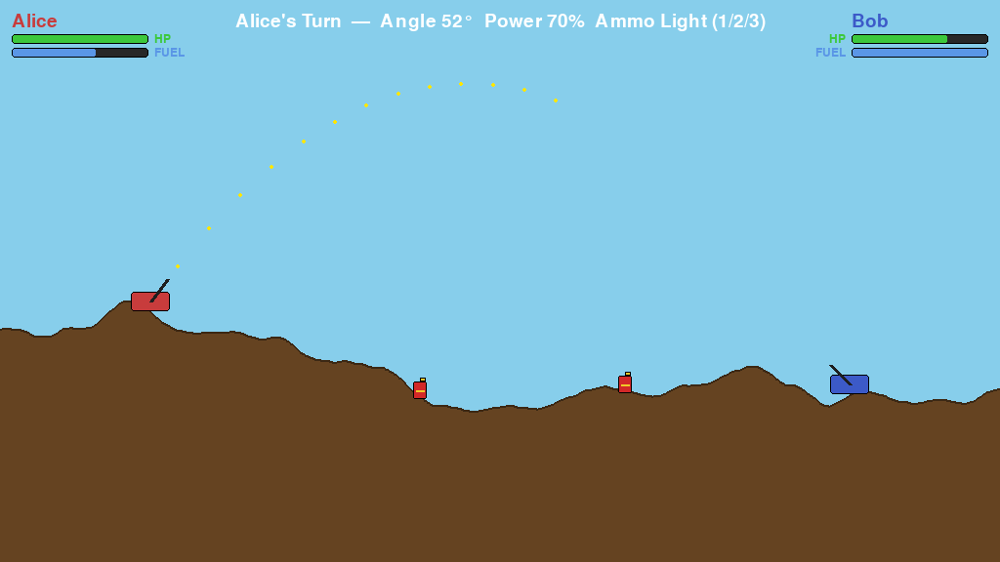
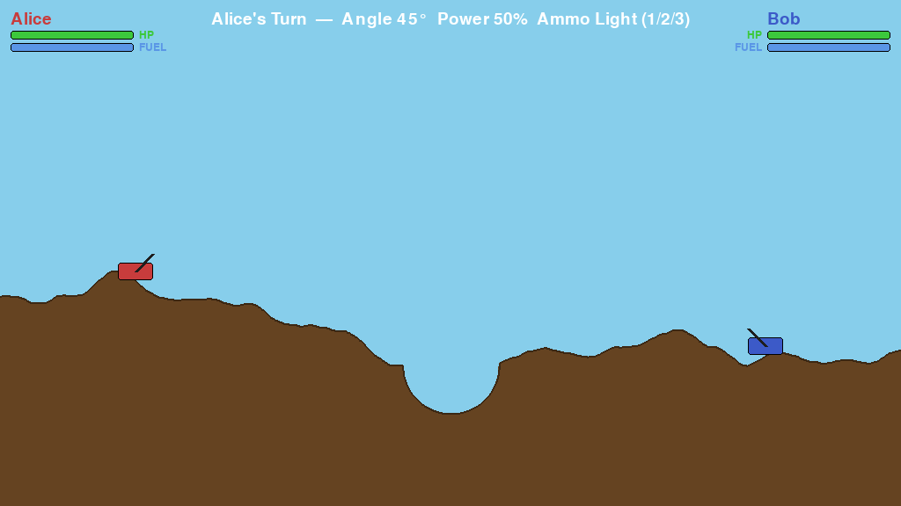
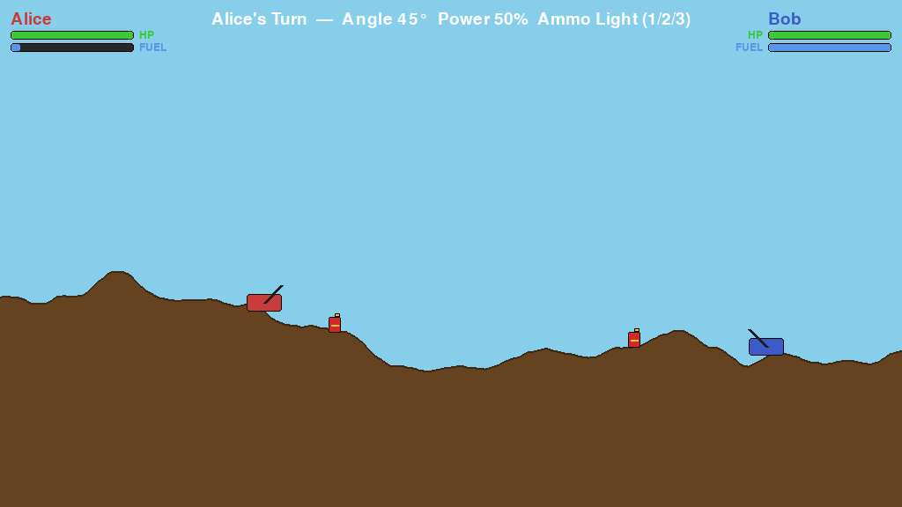
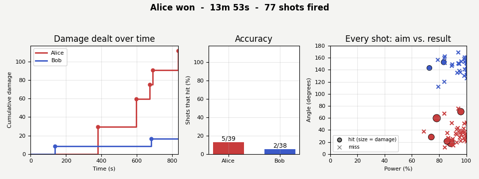

# Tank Battle

A real-time, turn-based, network-multiplayer artillery game (in the spirit of *Scorched
Earth* / *Worms*) written in Python with [Pygame](https://www.pygame.org/). Two players
connect over TCP sockets, aim across procedurally generated, destructible terrain, and
trade shells until one tank is left standing.

The project is built as an authoritative-server / thin-client system: `server.py` owns
the entire simulation (physics, collisions, damage, turn order, fuel cans, match
statistics) and runs headless;
`client.py` only renders whatever the server broadcasts and sends the local player's
input. This mirrors how real multiplayer games are structured, and is the reason the
project is split across dedicated `engine/`, `models/`, `ui/`, and networking modules
rather than one script.



| | | |
| --- | --- | --- |
|  |  |  |
| Hits: debris, smoke, flash, damage number | Destructible terrain | Fuel cans to refuel |

## Documentation

| Document | What it covers |
| --- | --- |
| **[docs/FEATURES.md](docs/FEATURES.md)** | **The full gameplay guide, with screenshots:** turn rules, aiming, ammo stats, physics, damage formula, terrain, fuel cans, effects, menu, match statistics, networking, and where to tune each number |
| [ProjectArchitecture.md](ProjectArchitecture.md) | The original design document and the phase-by-phase build plan |
| [docs/sample_match.json](docs/sample_match.json), [docs/sample_match.png](docs/sample_match.png) | An example saved match and its chart |
| [docs/make_screenshots.py](docs/make_screenshots.py) | Regenerates the images in `docs/screenshots/` |

## Features

Each item links to its section in the [feature guide](docs/FEATURES.md), which has the
details, exact numbers and screenshots.

- **[Turn-based play](docs/FEATURES.md#1-turn-structure)** - on your turn, either move or
  fire; adjust angle, power and ammo freely first
- **[Live trajectory preview](docs/FEATURES.md#2-aiming-and-the-trajectory-preview)** -
  a dotted arc that shows the first 60 % of your shot
- **[Three shell types](docs/FEATURES.md#3-ammunition)** - Light, Medium and Heavy differ
  in damage, blast size and weight, and even the shell's on-screen (and hit) size
- **[Projectile physics](docs/FEATURES.md#4-projectile-physics)** - gravity is scaled by
  shell weight, so heavy shells fly flatter and drop faster
- **[Distance-based damage](docs/FEATURES.md#5-hits-and-damage)** - full damage on a direct
  hit, falling off to nothing at the edge of the blast; floating "-N HP" numbers and a
  white hit flash show what landed
- **[Destructible terrain](docs/FEATURES.md#6-destructible-terrain)** - every explosion
  carves a crater into the per-column height map
- **[Fuel and fuel cans](docs/FEATURES.md#7-fuel-and-fuel-cans)** - moving burns fuel;
  cans spawn at random spots on the map, and driving over one refuels your tank
- **[Labelled HUD](docs/FEATURES.md#8-hud)** - HP and fuel bars for both players, plus the
  current angle, power and ammo
- **[Visual effects](docs/FEATURES.md#9-visual-effects)** - smoke trails, debris and smoke
  on impact, and screen shake scaled to the blast
- **[Sound](docs/FEATURES.md#10-sound)** - effects are synthesized in code, so no audio
  assets are needed
- **[Menu, renaming and restart](docs/FEATURES.md#11-menu-renaming-and-restarting)** -
  change your name mid-game and restart a finished match
- **[Match statistics](docs/FEATURES.md#12-match-statistics-and-end-screen)** - every shot
  is logged to JSON, and a matplotlib chart of the match is saved as a PNG and shown on
  the end screen
- **[Client/server networking](docs/FEATURES.md#13-networking)** - length-prefixed JSON
  over TCP with an authoritative server, playable across a LAN

## Requirements

- Python >= 3.10
- [uv](https://docs.astral.sh/uv/) (recommended) or `pip`
- An audio-capable environment is optional - sound effects fail silently if no audio
  device is available

## Installation

```sh
git clone https://github.com/NimeshBhavsar/Battle-Tanks.git
cd Battle-Tanks
uv pip install -e .
```

This installs the `tankbattle` package (declared via `pyproject.toml`'s
`[build-system]`, using `uv_build`) in editable mode, along with its two runtime
dependencies: `pygame` (the game itself) and `matplotlib` (the end-of-match statistics
chart).

## Running

The game needs three processes: one server and two clients (each client opens its own
window). Run each in a separate terminal:

```sh
uv run -m tankbattle server
uv run -m tankbattle client   # player 1
uv run -m tankbattle client   # player 2
```

(A console-script shortcut is also installed, so `uv run tankbattle server` /
`uv run tankbattle client` work identically.)

By default the server listens on `127.0.0.1:5555`. Both subcommands accept `--host` and
`--port` if you want to play across a LAN instead of on one machine:

```sh
uv run -m tankbattle server --host 0.0.0.0 --port 5555
uv run -m tankbattle client --host <server-ip> --port 5555
```

## Using the package from Python

The main building blocks are exported from the top-level package:

```python
from tankbattle import Tank, Terrain, HeavyShell, GameServer, GameClient

terrain = Terrain(seed=1)
tank = Tank(player_id=1, x=200, y=terrain.height_at(200), color=(200, 60, 60))
tank.current_ammo = HeavyShell()
shell = tank.fire()
```

## Match statistics

The server records every shot (who fired, ammo, angle, power, damage dealt and taken).
When a match ends it writes two files into a `match_stats/` folder next to where the
server was started (the folder is git-ignored), and shows the chart on both players' end
screens. See the [feature guide](docs/FEATURES.md#12-match-statistics-and-end-screen) for
the JSON format and a real end-screen capture.

- `match_<date>_<time>.json` - the full shot log
- `match_<date>_<time>.png` - a three-panel matplotlib chart: cumulative damage over
  time, accuracy per player, and every shot plotted as power vs. angle (filled = hit)

An example from a bot-vs-bot match: [docs/sample_match.png](docs/sample_match.png) and
[docs/sample_match.json](docs/sample_match.json).



The chart code is in [report.py](src/tankbattle/report.py) and can be used on any saved
match:

```python
from tankbattle.stats import load_match, summarize
from tankbattle.report import save_report

match = load_match("docs/sample_match.json")
print(summarize(match))                     # shots / hits / accuracy / damage per player
save_report(match, "my_chart.png")
```

## Controls

Apply on your turn:

| Key(s) | Action |
| --- | --- |
| `Left`/`A`, `Right`/`D` | Move (spends the turn on release) |
| `Up`/`W`, `Down`/`S` | Rotate the barrel |
| `E` / `Q` | Increase / decrease firing power |
| `1` / `2` / `3` | Select Light / Medium / Heavy shell |
| `Space` | Fire (spends the turn) |
| `Esc` | Open/close the menu |
| `Tab` | (End screen) hide/show the match statistics |

In the menu: `N` edits your name, `R` restarts once a match has ended, `Esc` closes it.

For the rules behind these controls (what a turn allows, angle and power ranges, how
fuel is spent) see the [feature guide](docs/FEATURES.md#1-turn-structure).

## Project structure

```text
src/tankbattle/
    __main__.py         entry point for `python -m tankbattle`
    main.py              CLI (argparse) - dispatches to server or client
    server.py            authoritative GameServer: owns all game state, runs headless
    client.py             GameClient: renders server state, sends local input
    network.py            length-prefixed JSON message framing over TCP
    stats.py               MatchRecorder: logs every shot, saves/loads match JSON
    report.py              matplotlib chart of a finished match (PNG)
    settings.py            session config (starting stats, default host/port)

    models/                game objects
        tank.py, projectile.py, terrain.py, ammunition.py, player.py

    engine/                 rules, with no rendering/networking knowledge
        physics.py, collision.py, damage.py, turn_manager.py, terrain_engine.py

    ui/                     pygame rendering only
        game_screen.py, hud.py, menu.py, sound.py, effects.py, report_view.py

    utils/
        constants.py, helpers.py

assets/                    art/audio folders (currently empty placeholders -
                            sound effects are synthesized in code instead)

tests/                     pytest suite (conftest.py has the shared fixtures)

docs/                      FEATURES.md (gameplay guide), screenshots/, a sample saved
                            match, and make_screenshots.py

match_stats/               created by the server at run time: each match's JSON + PNG
                            (git-ignored)
```

## Course concepts

Where each topic actually shows up in this codebase:

- **Primitives, control flow, containers** - everywhere, but concentrated in
  [server.py](src/tankbattle/server.py) (`_tick`/`_apply_input`: if/elif chains, early
  returns), [terrain.py](src/tankbattle/models/terrain.py) (`destroy_circle`'s
  per-column loop over a `list` height map). Containers: `dict` for
  [server.py](src/tankbattle/server.py)'s `pending_inputs`/`client_sockets`,
  [client.py](src/tankbattle/client.py)'s `tanks_by_id`,
  [ammunition.py](src/tankbattle/models/ammunition.py)'s `AMMO_BY_NAME`; `tuple` for
  positions/velocities throughout; a list comprehension at
  `_advance_projectile` in [server.py](src/tankbattle/server.py)
  (`opponents = [p.tank for p in self.players if ...]`).

- **Functions** - small, pure, single-purpose functions are the backbone of `engine/`:
  [physics.py](src/tankbattle/engine/physics.py) (`launch_velocity`, `step`),
  [damage.py](src/tankbattle/engine/damage.py) (`calculate_damage`),
  [helpers.py](src/tankbattle/utils/helpers.py) (`clamp`, `distance`,
  `distance_to_segment`).

- **Classes** - one per file under `models/`, plus `TurnManager`, `GameServer`,
  `GameClient`. [tank.py](src/tankbattle/models/tank.py) is the clearest example of
  state + behavior encapsulated together; `@property` is used for computed attributes
  in [tank.py](src/tankbattle/models/tank.py) (`alive`) and
  [projectile.py](src/tankbattle/models/projectile.py) (`radius`, derived from
  ammo weight).

- **Inheritance & polymorphism** -
  [ammunition.py](src/tankbattle/models/ammunition.py): `Ammo` is the base class,
  `LightShell`/`MediumShell`/`HeavyShell` inherit from it and only override the
  constructor's values. The polymorphism is in how they're *used*: `Tank.fire()`
  ([tank.py](src/tankbattle/models/tank.py)) and `Projectile`
  ([projectile.py](src/tankbattle/models/projectile.py)) never check
  which subclass they hold - they just read `.weight`/`.damage`/`.blast_radius`/`.name`
  on whatever `Ammo` instance they were given.

- **Packaging** - [pyproject.toml](pyproject.toml) (`[build-system]`, `uv_build`,
  console-script entry point), the `src/` layout, and
  [`__main__.py`](src/tankbattle/__main__.py) for `python -m tankbattle`.

- **Version control** - the commit history shows incremental, meaningful progress
  (`v5.0` terrain deformation through `v10` end-of-match statistics).

- **Data analysis & visualization** - [stats.py](src/tankbattle/stats.py) records the
  shot log and computes per-player summaries; [report.py](src/tankbattle/report.py) plots
  it with matplotlib. numpy and pandas are not used - the datasets are tiny (dozens of
  shots), so plain lists/dicts were enough.

## Development notes

Code style is checked with [ruff](https://astral.sh/ruff) (configured in
`pyproject.toml`), and the game logic is covered by a [pytest](https://pytest.org) suite
in [tests/](tests/) (no display, network or audio device needed):

```sh
uv run pytest                 # 218 tests, a few seconds
uvx ruff check src tests docs
uvx ruff format --check src
```

The tests cover the pure game rules (physics, damage, collisions, terrain craters, tank
movement, turn order), the server logic driven without any sockets (fuel cans, impacts,
game over, restart, renaming, the one-time chart broadcast), the network framing, the
statistics and chart code, the visual effects, and the client's damage-popup logic.

**A bug found by the tests, and fixed:** while writing the server tests, the test
`test_cannot_fire_after_moving` failed. If a player released the move key and pressed
`Space` in the same frame, the server correctly ended their turn but then still let their
tank fire, so a shell was launched during the *opponent's* turn. The fix (in
`_apply_input` in [server.py](src/tankbattle/server.py)) ignores the rest of that input
once the turn has passed, and the test now guards against it coming back.

The server and client can each be exercised without a display: `server.py` never calls
into pygame's rendering/audio subsystems, and both were developed against headless
(`SDL_VIDEODRIVER=dummy`) smoke tests plus real two-window playtests before each
feature was considered done. The chart code uses matplotlib's `Figure` class directly
(not `pyplot`), so it also runs headless and on a background thread.

The screenshots in the docs are regenerated with:

```sh
uv run python docs/make_screenshots.py
```

## Status

All phases from [ProjectArchitecture.md](ProjectArchitecture.md)'s milestone list are
implemented: window/terrain/turn setup, tank controls, projectile physics, combat,
terrain deformation, client/server networking, and polish (animation, sound, HUD,
restart flow). Features added after that plan - fuel cans, floating damage numbers,
smoke/debris/screen-shake effects, and match statistics with a matplotlib chart - are
described in the [feature guide](docs/FEATURES.md).
