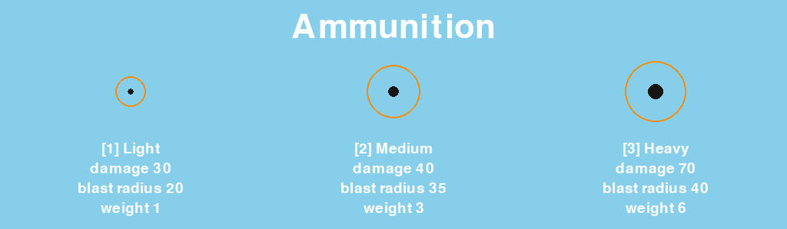
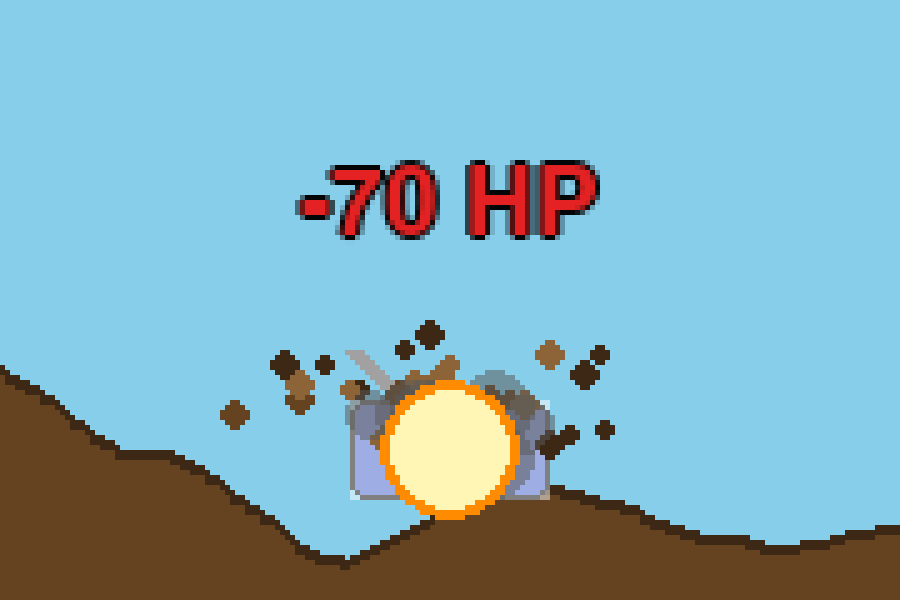
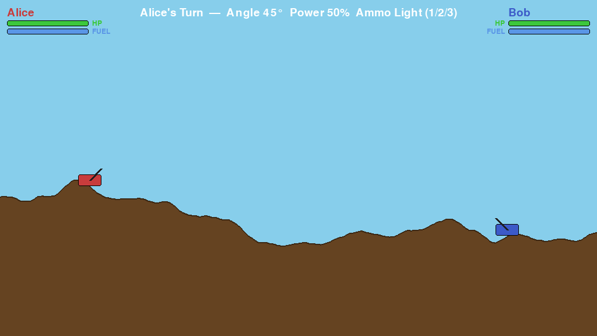
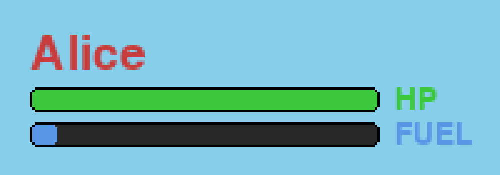
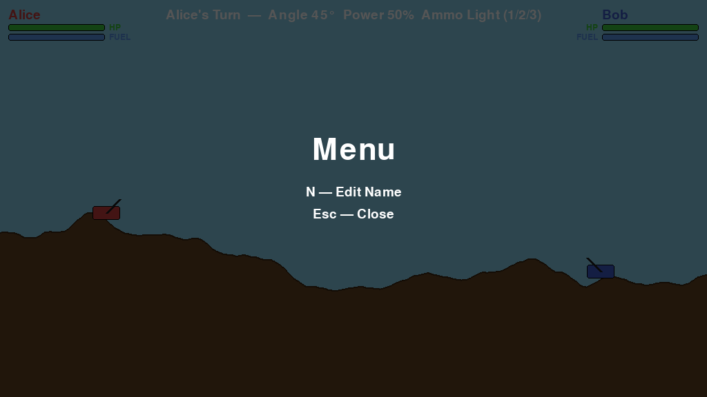
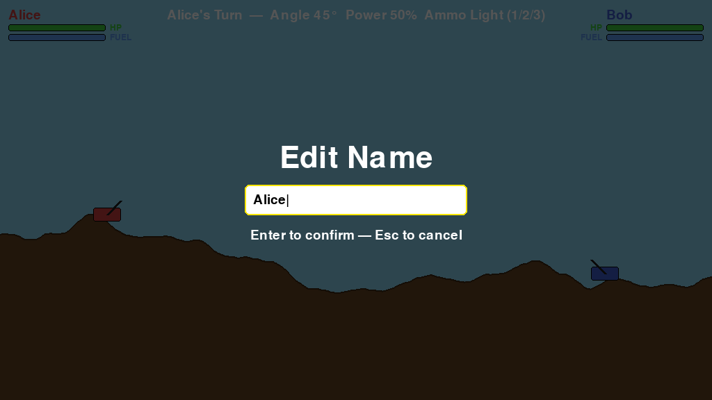
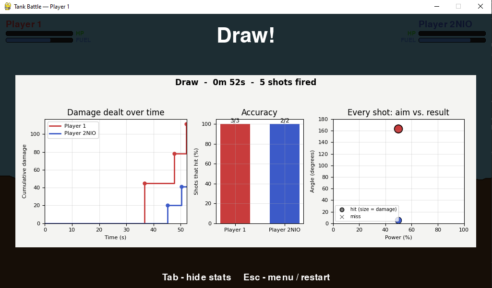
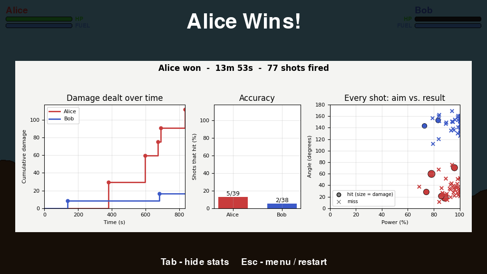

# Tank Battle - Feature Guide

Tank Battle is a two-player, turn-based artillery game. Each player runs their own window and connects to one shared server over the network. This guide describes everything the game does, with screenshots.

> **About the screenshots.** Images `01`-`10` in [screenshots/](screenshots/) are rendered
> by [make_screenshots.py](make_screenshots.py), which draws scripted scenes with the
> game's own rendering code (no second player needed, so they can be regenerated any
> time). [sample_stats_draw.png](sample_stats_draw.png) is a genuine capture from a live
> two-player match.

**Contents**

- [Tank Battle - Feature Guide](#tank-battle---feature-guide)
  - [1. Turn structure](#1-turn-structure)
  - [2. Aiming and the trajectory preview](#2-aiming-and-the-trajectory-preview)
  - [3. Ammunition](#3-ammunition)
  - [4. Projectile physics](#4-projectile-physics)
  - [5. Hits and damage](#5-hits-and-damage)
  - [6. Destructible terrain](#6-destructible-terrain)
  - [7. Fuel and fuel cans](#7-fuel-and-fuel-cans)
  - [8. HUD](#8-hud)
  - [9. Visual effects](#9-visual-effects)
  - [10. Sound](#10-sound)
  - [11. Menu, renaming and restarting](#11-menu-renaming-and-restarting)
  - [12. Match statistics and end screen](#12-match-statistics-and-end-screen)
  - [13. Networking](#13-networking)
  - [14. Tuning the game](#14-tuning-the-game)

---

## 1. Turn structure

Players alternate turns. On your turn you may adjust your aim and ammo freely, and then
spend the turn on **one** of two actions:

- **Move** - hold `Left`/`A` or `Right`/`D`. The turn ends when you release the key.
- **Fire** - press `Space`. The turn ends when the shell has exploded.

You cannot fire after moving, or move after firing. The match ends when only one tank has
health left; if a single shell destroys both tanks the result is a draw. A tank can also
be damaged by its own shells.


| Key(s) | Action |
| --- | --- |
| `Left`/`A`, `Right`/`D` | Move (spends the turn on release) |
| `Up`/`W`, `Down`/`S` | Rotate the barrel (0-180 degrees, 2 degrees per frame) |
| `E` / `Q` | Increase / decrease firing power (0-100 %, 1 % per frame) |
| `1` / `2` / `3` | Select Light / Medium / Heavy shell |
| `Space` | Fire (spends the turn) |
| `Esc` | Open / close the menu |
| `Tab` | On the end screen: hide / show the match statistics |

## 2. Aiming and the trajectory preview

On your turn a dotted yellow arc shows where the shell would fly with the current angle,
power and ammo. It only shows the **first 60 %** of the arc, so the last stretch still
takes judgement. The preview follows the same physics as the real shot, so it changes
with the shell you have selected. Only the player whose turn it is sees it.

(Visible in the first screenshot above: the dotted arc leaving Alice's barrel.)

## 3. Ammunition

Three shell types, chosen with `1`, `2` and `3`:

| Shell | Weight | Damage | Blast radius | Ball size |
| --- | --- | --- | --- | --- |
| Light | 1 | 30 | 20 px | small (radius 4 px) |
| Medium | 3 | 40 | 35 px | medium (radius 7 px) |
| Heavy | 6 | 70 | 40 px | large (radius 10 px) |

Heavier shells hit harder and blow bigger craters, but they drop faster (see below) and
are larger, which also makes them easier to land on a target. The on-screen size of the
shell *is* its hit size.



*(Orange rings show each shell's blast radius.)*

## 4. Projectile physics

- **Launch speed** is `power x 0.25` pixels per frame, so 100 % power is 25 px/frame.
- **Gravity** is applied every frame and scaled by shell weight:
  `9.8 x weight x 0.05` -> Light 0.49, Medium 1.47, Heavy 2.94 px/frame^2. Heavy shells
  therefore follow a much flatter, faster-falling arc than Light ones.
- A shell explodes when it touches a tank, the ground, or leaves the map.

## 5. Hits and damage

**Hitbox.** A tank is hit if a shell touches its body *or* its barrel, and both have a
10 px forgiving margin (plus the shell's own radius), so near misses that clip the tank
still count.

**Damage falloff.** Damage is measured from the explosion to the *nearest part of the
tank* (body rectangle or barrel), then falls off linearly with distance:

```text
damage = shell damage x (1 - distance / blast radius)     (0 at or beyond the blast radius)
```

A shell exploding inside the tank does full damage; one that just clips the padded edge
does reduced damage. Every tank inside the blast is damaged, including the shooter's.
Each tank starts with 100 HP.

**Feedback when a tank is hit:**

- a red **-N HP** floats up from above the tank and fades out;
- the tank **flashes white** and fades back;
- the HP bar drops immediately.


Close-up of the same frame (the tank is mid-flash, under the fireball and debris):



## 6. Destructible terrain

The ground is stored as a **height map** - one ground height for each of the 1024 pixel
columns - generated as a random walk that is then smoothed, so every match has different
hills. An explosion carves a circular crater into it (radius = the shell's blast radius),
and tanks settle onto the new ground level afterwards. Craters can strip away cover or open a
line of fire.

| Before | After a Heavy shell |
| --- | --- |
|  |  |

## 7. Fuel and fuel cans

Moving costs **fuel** (0.5 per frame; a full tank of 100 lasts about 200 frames, roughly
600 px of driving). At zero fuel a tank cannot move.

**Fuel cans** (small red jerrycans) appear at random spots along the ground:

- 2 cans are on the map when a match starts;
- one more appears at the end of every turn, up to a maximum of 3 at a time;
- a can never spawns within 80 px of a tank or another can, or within 40 px of the map
  edge, and it follows the terrain if a crater changes the ground under it;
- driving a tank over a can collects it and restores **40 fuel** (capped at 100).

The screenshot below shows Alice nearly out of fuel with a can just ahead:


## 8. HUD

Both players' status is always visible at the top of the screen, whoever's turn it is:

- the player's **name**, in their tank colour;
- a green **HP** bar and a blue **FUEL** bar, each labelled;
- in the centre, whose turn it is together with the current **angle**, **power** and
  **ammo**.



## 9. Visual effects

All effects are drawn by each client and never change the game itself
([effects.py](../src/tankbattle/ui/effects.py)).

| Effect | What it does |
| --- | --- |
| **Smoke trail** | A fading grey puff is left behind every shell in flight, so its arc stays visible for a moment. |
| **Explosion** | An expanding shockwave ring around a shrinking fireball core. |
| **Debris & smoke** | Dirt clods spray up and fall under gravity; darker smoke puffs rise and swell. The number scales with the blast size. |
| **Screen shake** | The whole screen shakes for a moment after an explosion, harder for bigger shells (0.15 px of shake per pixel of blast radius). |
| **Hit flash** | A hit tank flashes white and fades back over about 0.2 s. |
| **Damage numbers** | Red "-N HP" text with a dark outline rises and fades over about 1.25 s. |


## 10. Sound

Sound effects for firing and for explosions are **synthesized in code** (a short 880 Hz
tone and a low 120 Hz thud), so the game needs no audio files. If no audio device is
available the game runs silently.

## 11. Menu, renaming and restarting

Press `Esc` to open the menu:

| Key | Action |
| --- | --- |
| `N` | Edit your name (up to 16 characters) |
| `R` | Restart the match - only offered once a match has ended |
| `Esc` | Close the menu |



Renaming works at any time, even when it is not your turn, and the new name appears for
both players straight away.



Restarting generates a new random map and resets health, fuel, fuel cans and statistics.

## 12. Match statistics and end screen

The server records **every shot**: who fired, which ammo, the angle and power used, the
time into the match, and the damage each tank took. When the match ends it:

1. saves the log as `match_stats/match_<date>_<time>.json`;
2. draws a three-panel [matplotlib](https://matplotlib.org/) chart and saves it next to
   the JSON as a `.png`;
3. sends the chart to both clients, which show it on the end screen.

The chart contains:

- **Damage dealt over time** - cumulative damage per player (dots mark each hit);
- **Accuracy** - the percentage of each player's shots that hit, labelled hits/shots;
- **Every shot: aim vs. result** - each shot plotted as power against angle; filled
  circles are hits (sized by damage), crosses are misses.

Press `Tab` on the end screen to hide the chart and look at the final battlefield, and
`Esc` for the menu to restart.

A genuine end screen from a live match (which ended in a draw):



End screen rendered from a longer bot-vs-bot match, which shows a winner:



The saved files can be reused - see [sample_match.json](sample_match.json) and
[sample_match.png](sample_match.png):

```python
from tankbattle.stats import load_match, summarize
from tankbattle.report import save_report

match = load_match("docs/sample_match.json")
print(summarize(match))          # shots / hits / accuracy / damage dealt per player
save_report(match, "chart.png")
```

Each shot in the JSON looks like this:

```json
{
  "player_id": 1, "ammo": "Medium", "angle": 30.1, "power": 69.8, "time_s": 12.4,
  "n": 1, "damage": {"1": 0.0, "2": 27.5}, "damage_dealt": 27.5, "hit": true
}
```

## 13. Networking

The game is an **authoritative server with thin clients**:

- The **server** ([server.py](../src/tankbattle/server.py)) owns the whole simulation -
  physics, collisions, damage, terrain, turn order, fuel cans and statistics. It runs
  without a window and ticks 60 times a second.
- Each **client** ([client.py](../src/tankbattle/client.py)) only draws what the server
  sends and reports its player's held keys. It never decides what happens, so neither
  player can cheat by modifying their client.
- Messages are JSON over TCP, each prefixed by a 4-byte length
  ([network.py](../src/tankbattle/network.py)). Three types travel from the server:
  `welcome` (your player id), `state` (a full snapshot every tick) and `report` (the
  match chart, sent once at the end). Clients send their input every frame:
  `move`, `rotate`, `power`, `fire`, `ammo`, `restart` and `name`.

To play across a network, start the server with `--host 0.0.0.0` and point the clients at
its IP address (see the [README](../README.md#running)).

## 14. Tuning the game

Gameplay numbers live in two files, so balance changes need no code changes:

| Setting | Where |
| --- | --- |
| Starting health and fuel, stats folder, default host and port | [settings.py](../src/tankbattle/settings.py) |
| Shell damage, weight and blast radius | [ammunition.py](../src/tankbattle/models/ammunition.py) |
| Move speed, fuel cost, rotation, power step, projectile physics | [constants.py](../src/tankbattle/utils/constants.py) |
| Hitbox padding, fuel-can rules, effect strengths and timings | [constants.py](../src/tankbattle/utils/constants.py) |

To regenerate the screenshots after changing the look of the game:

```sh
uv run python docs/make_screenshots.py
```
